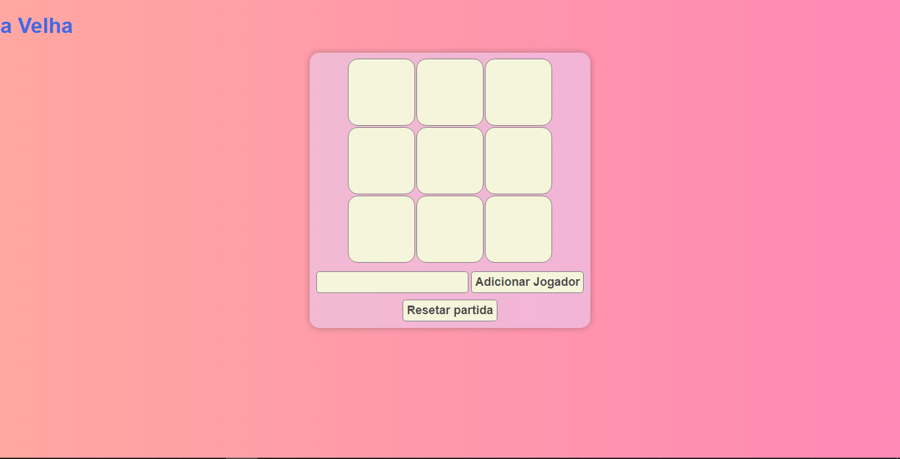
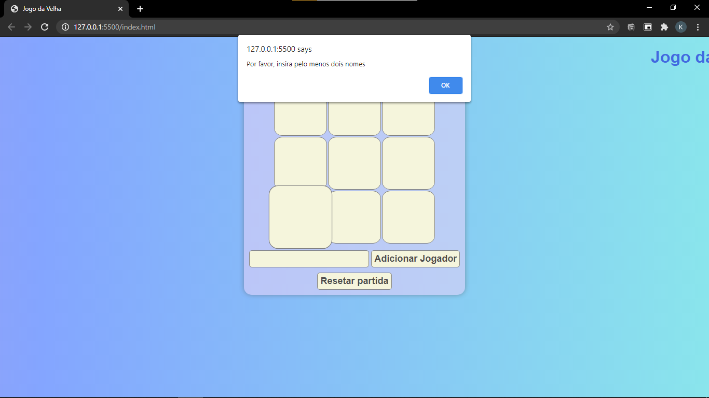
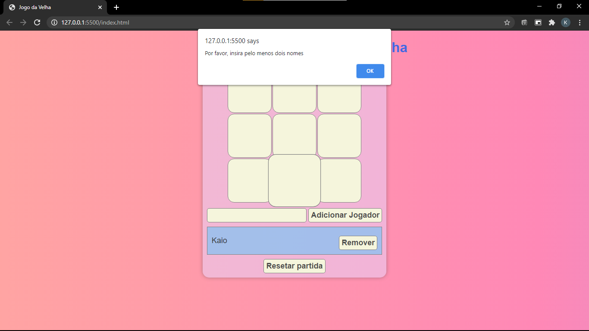
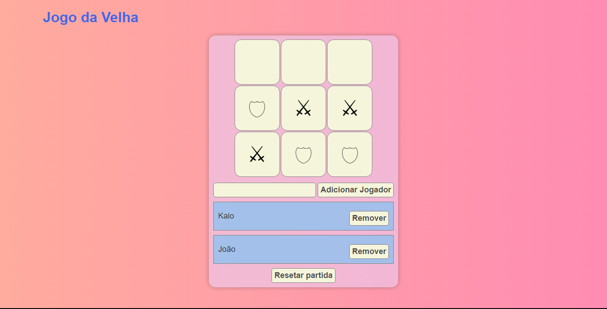
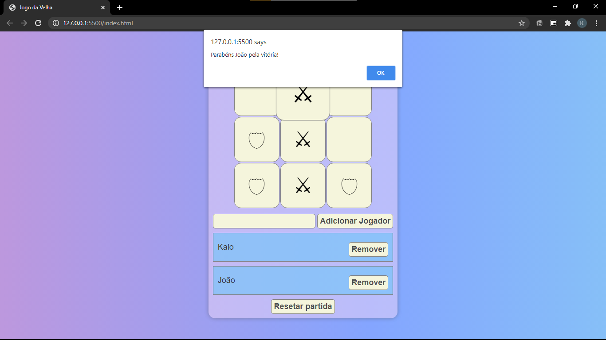
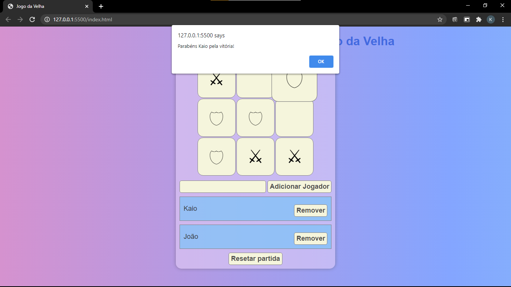

# Jogo da Velha

Jogo criado no curso do ProgramadorBr com algumas alterações minhas.

[Site]( https://kaio-matos.github.io/jogo_da_velha/)

## Tela inicial

## Verificação dos nomes

## Verificação do segundo nome

## Escudo e espada sendo colocados

## Verificação do ganhador e alerta de quem ganhou

## Verificação do ganhador e alerta de quem ganhou

### Acrescentado por mim até o momento:

* Inserir os jogadores
* Remover os jogadores
* Botão de resetar a partida
* Cores no fundo e animações simples

[Meu Linkedin](https://www.linkedin.com/in/kaio-matos-9532271a5)
